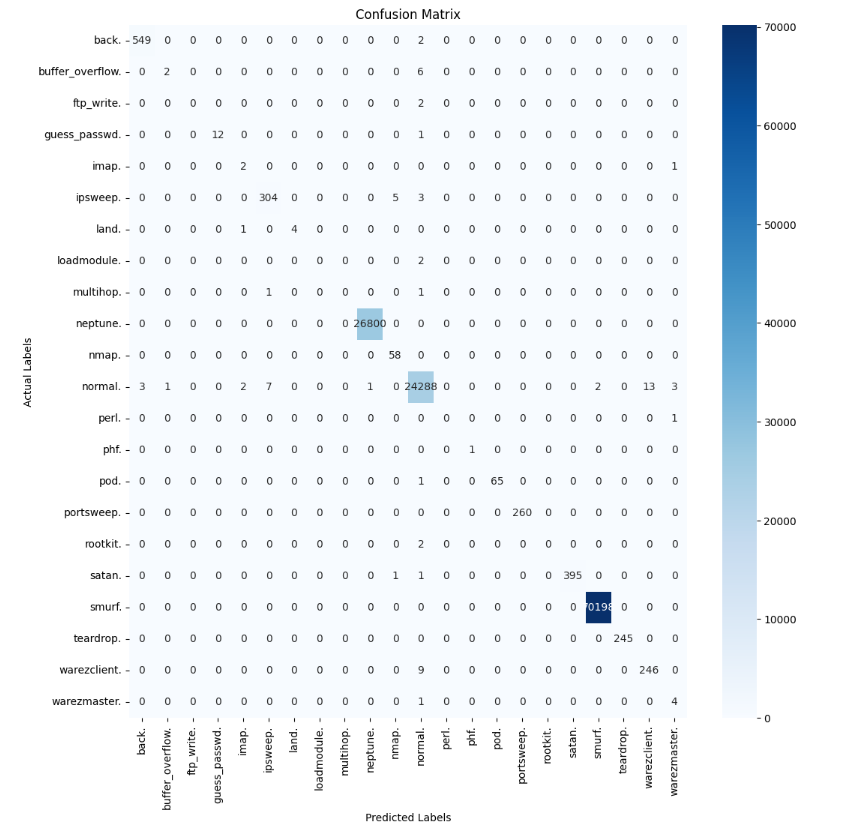

# Intrusion Detection System using Neural Network wiht KDD-99 Dataset

This project implements an Intrusion Detection System (IDS) using the well-known KDD-99 dataset and a multi-layer Neural Network. The system aims to classify network traffic.

---

## Dataset

The project utilizes the **KDD Cup 1999 dataset**, one of the most widely used datasets for evaluating intrusion detection systems. It includes various types of network attacks such as DoS, R2L, U2R, and Probing.

**Note:** Due to its large size, the `Dataset` folder is not included in this repository. You can download the dataset from the link below and place it in a `Dataset` directory at the project root.

- [Download KDD-99 Dataset](https://www.kaggle.com/datasets/galaxyh/kdd-cup-1999-data)

---

## Installation and Setup

To run this project, follow these steps:

1.  **Clone the repository:**

    ```bash
    git clone https://github.com/ErfanRezaei/Intrusion-Detection-System
    cd Intrusion-Detection-System
    ```

2.  **Install the required libraries:**
    ```bash
    pip install pandas numpy scikit-learn tensorflow seaborn matplotlib jupyterlab
    ```
    Note: It's highly recommended to use a virtual environment to keep project dependencies isolated.

---

## How to Run

After installing the dependencies, you can run the project notebook using the following command:

```bash
jupyter lab "Intrusion Detection System.ipynb"
```

Execute the cells in the notebook sequentially to see the results.

---

### Confusion Matrix

The following matrix illustrates the model's performance in classifying different types of attacks and normal traffic:



As shown in the matrix, the model performs exceptionally well in detecting common attacks like `smurf` and `neptune`, as well as `normal` traffic.

---
